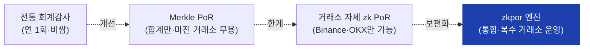
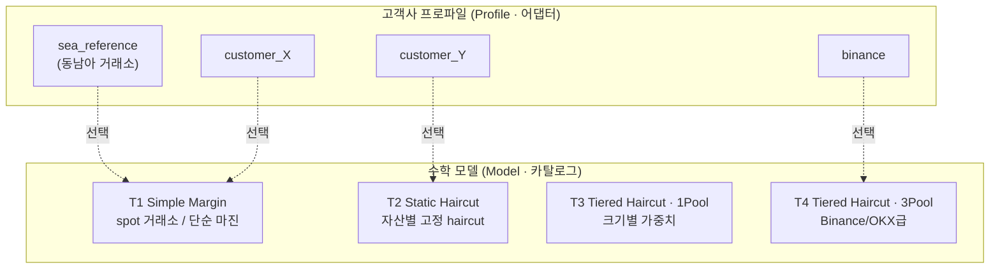
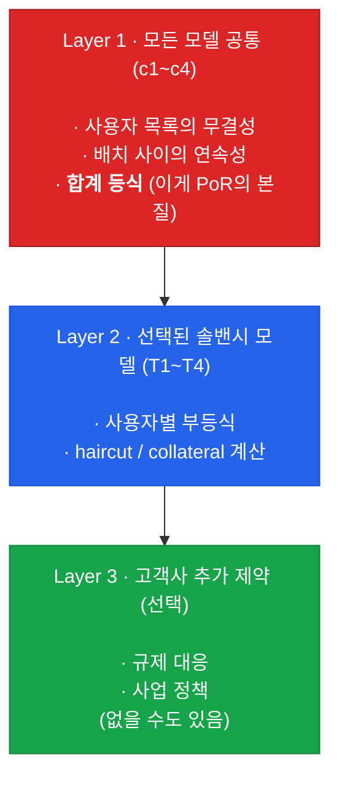
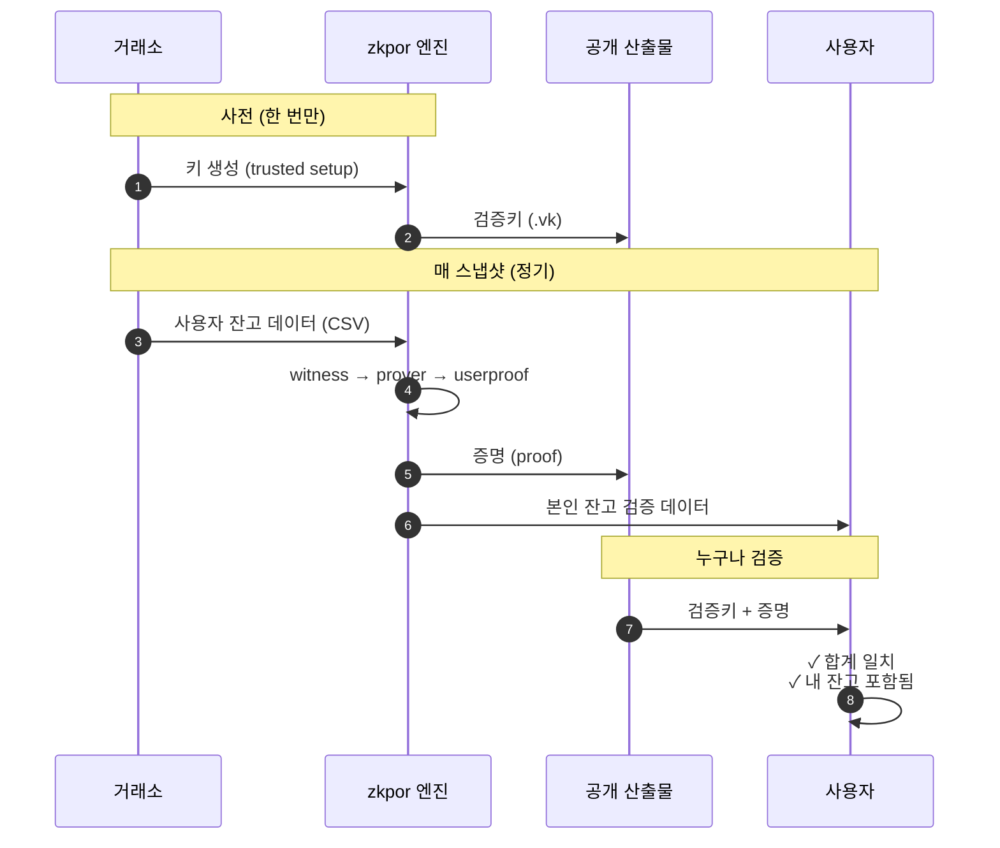
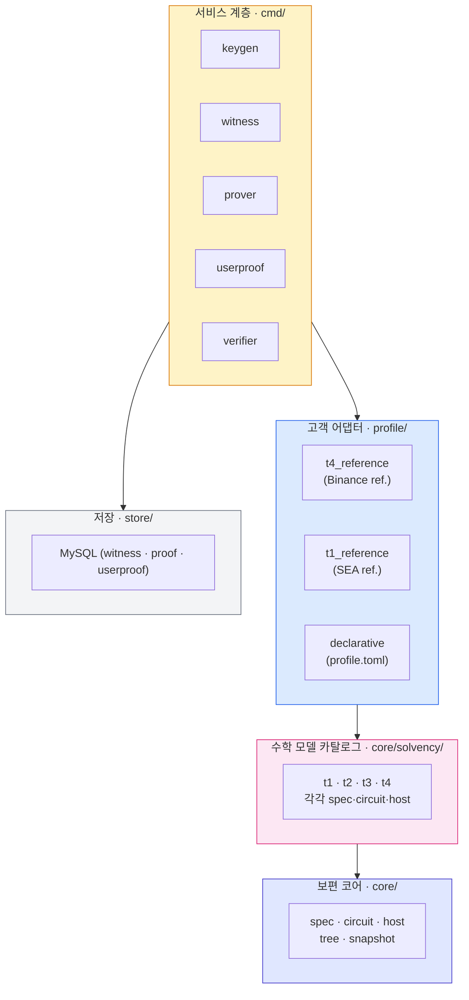

# zkpor — 거래소 솔밴시 증명 엔진

> 한 문장으로: **"거래소가 발표한 자산 총량이 실제 사용자 잔고의 합과 같다"**
> 를 사용자 데이터를 노출하지 않고 수학적으로 증명해주는 엔진 제품.

이 문서는 팀이 zkpor 프로젝트의 그림을 빠르게 잡기 위한 입문서입니다. 코드/암호학
용어보다는 **"왜 이렇게 만들었고, 이 시스템을 어떻게 머리에 그려야 하나"** 를
우선합니다. 세부는 `docs/01-project-context.md` 이하 참조.

---

## 1. 왜 만들었나

거래소의 "예치금 다 있어요" 주장은 전통적으로 두 가지 방식으로 입증되어 왔습니다.

| 방식 | 한계 |
|---|---|
| 외부 회계감사 | 비싸고 느림. 1년에 한 번. 회계법인을 믿어야 함. |
| Merkle PoR (대부분 거래소) | 자산 *합계* 만 증명. "이 자산이 누구 거고 부채는 얼마인지" 는 못 말함. 마진/론 사업이 있는 거래소는 무용지물. |

zk 기반 PoR은 이 한계를 두 가지로 메웁니다.

1. **합계뿐 아니라 사용자 한 명 한 명의 조건** 까지 검증 (예: 부채보다 자산이 많은가).
2. **사용자 잔고는 비공개로 유지**. 누구나 검증할 수 있지만 누구도 남의 잔고를 못 봄.

문제는 **이걸 직접 구현한 거래소가 전 세계에서 Binance, OKX 2~3곳뿐** 이라는 점.
나머지 거래소들은 "우리도 zk PoR 하고 싶지만 자체 개발은 못 한다" 상태.

→ **zkpor는 이 격차를 메우는 엔진 제품**. 한 번 만들어 둔 검증된 엔진을
여러 거래소에 SaaS 형태로 통합 판매합니다.



---

## 2. 멘탈모델 ① — Model × Profile 두 축

zkpor를 이해할 때 가장 먼저 잡아야 할 것: **두 개의 직교 축이 있다.**

- **Model (수학)** — 솔밴시를 어떻게 정의할지. "사용자별로 어떤 부등식을 검증할 것인가."
- **Profile (배포)** — 어느 거래소의 데이터를 어떻게 끼워 넣을지. "CSV 컬럼 매핑, ID 체계, 자산 카탈로그."

같은 수학식(Model)을 여러 거래소(Profile)가 공유할 수 있고, 한 거래소가 사업이
바뀌면 Model만 갈아 끼우면 됩니다.



### 왜 이렇게 나눴나

만약 거래소마다 회로를 새로 짠다면 — 매번 감사를 새로 받아야 하고, 코드가
N배로 증식합니다. 반대로 "한 회로가 모든 케이스를 다 처리"하게 만들면 — 단순한
거래소까지 복잡한 검증 비용을 강제로 부담합니다.

**그래서 "수학 카탈로그"를 따로 두고 고객은 거기서 골라 쓰게 했습니다.** 카탈로그
한 entry당 한 번만 감사받으면, 그 모델을 쓰는 모든 거래소가 그 감사 신뢰를
공유합니다.

---

## 3. 멘탈모델 ② — 한 회로 안의 3개 층

선택된 Model에 대해 회로(증명 회로)가 강제하는 제약은 항상 3개 층으로 쌓입니다.



핵심 규칙: **위 층의 제약은 아래 층이 절대 약화시키지 못한다 (add-only).** 고객이
원해서 어떤 검사를 끄는 것은 불가능합니다. 추가만 가능. 이게 "고객마다 다른 규제
요구"를 안전하게 받아들이는 메커니즘입니다.

---

## 4. 한 스냅샷이 흐르는 길

거래소가 zkpor을 운영할 때 실제로 무슨 일이 일어나는지.



다섯 개의 도구가 이 흐름을 분담합니다 (`cmd/` 디렉터리).

| 도구 | 언제 돌리나 | 무엇을 만드나 |
|---|---|---|
| `keygen` | 사전 1회 (모델/규모별) | 증명·검증에 쓸 키 |
| `witness` | 매 스냅샷 | CSV → 회로 입력 |
| `prover` | 매 스냅샷 | 증명 (가장 무거운 단계) |
| `userproof` | 매 스냅샷 | 사용자가 자기 잔고를 확인할 수 있는 경로 |
| `verifier` | 누구나·언제든 | 증명이 유효한지 확인 |

---

## 5. 우리가 보장하는 것 vs 보장 못 하는 것

이 시스템을 팔 때 가장 정확하게 말해야 하는 부분입니다.

### ✅ 보장하는 것

- 거래소가 발표한 자산 총량 = 사용자 잔고의 합 (수학적으로).
- 선택된 모델의 사용자별 솔밴시 조건을 모든 사용자가 통과 (예: 부채 ≤ 자산).
- 위 두 가지를 **사용자 데이터를 노출하지 않고** 증명.
- 사용자는 본인 잔고가 dataset에 포함됐는지 확인 가능.

### ❌ zk 단독으로 못 보장하는 것

- 거래소가 dataset에서 **누락시킨** 사용자 (있는데 안 넣은 경우).
- 거래소 내부 ETL이 잔고를 정확히 뽑았는지.
- snapshot 시점 *이후* 의 잔고 변동.
- "솔밴시 모델 자체가 합리적인가" (이건 audit + governance의 영역).

이 한계를 모른 채 "zk PoR이면 100% 안전"으로 마케팅하면 신뢰를 잃습니다. 우리는
이 경계를 명확하게 그어 둔 것이 차별점 중 하나입니다.

---

## 6. 핵심 특징

신규로 이 프로젝트에 손을 댈 때 알아두면 좋은 것들.

### 6.1 "모델 카탈로그 + 고객 어댑터" 구조

- 새 거래소를 받을 때 **회로를 새로 짜지 않습니다.** 카탈로그(T1~T4)에서 고르고,
  어댑터(`profile/<customer>/`)만 작성.
- 첫 도입은 보통 1~4개월. 이게 차별화 우위.

### 6.2 수학과 사업 이름의 엄격한 분리

- 모델 이름에 거래소 이름을 박지 않습니다 (`t4_tiered_haircut_margin_3pool` ✓,
  `binance_v2` ✗).
- 같은 모델을 5개 거래소가 공유하면 감사 신뢰가 5배로 증폭됩니다.

### 6.3 add-only 확장

- 고객이 추가 제약(규제 대응 등)을 얹을 수 있지만, **기존 검증을 제거하거나
  약화시키는 경로는 차단**. 코드 구조로 강제.

### 6.4 검증은 stateless·공개

- 검증키와 증명만 있으면 누구나, 어디서나, 우리 인프라 없이도 검증 가능.
- 우리는 엔진을 팔지, "신뢰 자체" 를 팔지 않습니다.

### 6.5 GTM은 카탈로그 진척 순서와 다름

- 기술 진척은 T4(Binance)부터 — Binance OSS 코드를 출발점으로 썼기 때문.
- **시장 우선순위는 T1부터** — 동남아 거래소 대부분이 T1. 진척과 시장이 역전.
- 그래서 R4 이후 작업은 T1을 주력 제품으로 끌어올림.

---

## 7. 코드가 어디에 사는가

거시 지도. 세부는 `docs/03-system-architecture.md`.



의존 방향은 **위에서 아래로만**. 같은 층의 패키지끼리는 서로 import하지 않음
(고객끼리 분리·모델끼리 분리).

---

## 8. 현재 어디까지 왔나

| 단계 | 상태 |
|---|---|
| 4개 솔밴시 모델 (T1~T4) 회로 구현 | ✅ 완료 |
| 2개 reference 고객 어댑터 (binance, SEA) | ✅ 완료 |
| 5개 서비스 4-model dispatch | ✅ 완료 |
| End-to-end smoke (4모델 모두) | ✅ 통과 |
| 대규모 성능·메모리 측정 (R11-D, EC2) | ⏳ 진행 중 (Phase 2) |
| GPU 가속 / 다중 prover | 후속 |

자세한 stage 진척은 `PRODUCTION_ROADMAP.md`, 현재 시점 상태는 `HANDOFF.md`.

---

## 9. 더 읽을 문서 (우선순위 순)

| 문서 | 언제 읽나 |
|---|---|
| `AGENTS.md` | 작업 시작 시 가장 먼저 — 작업 규약 |
| `docs/01-project-context.md` | 개념·강한 보장·V1 범위 |
| `docs/02-module-architecture.md` | 고객 추가 제약(Module)을 만들 때 |
| `docs/03-system-architecture.md` | 시스템 그림 자세히 (다이어그램 다수) |
| `docs/04-solvency-models.md` | 4개 모델의 산업 reference + 결정 트레일 |
| `PRODUCTION_ROADMAP.md` | stage·gate 진척 |
| `HANDOFF.md` | 지금 무엇이 진행 중인지 |
| `docs/BENCHMARK.md` | 성능·메모리·비용 견적 단일 진실원 |

---

## 부록 A — Go 의존성으로 통합 (gnark fork replace 필수)

zk-pos-ext 는 **자립 Go 모듈**입니다.

- module path: `github.com/BetweenBits-org/zk-pos-ext`
- 로컬 빌드/테스트: `cd zkpor && go build ./... && go test -short ./...`

**다른 Go 모듈에서 import 할 때는, 자기 `go.mod` 에 아래 `replace` 2줄을
반드시 추가해야 합니다.** (없으면 빌드 실패 또는 증명/검증이 깨짐.)

```
replace (
    github.com/consensys/gnark        => github.com/bnb-chain/gnark        v0.10.1-0.20240910145009-4b5261061f04
    github.com/consensys/gnark-crypto => github.com/bnb-chain/gnark-crypto v0.14.1-0.20240910145340-609ab3a7eb9b
)
```

### 왜 필요한가

- 엔진은 `consensys/gnark` 를 import 하지만 실제로는 **Binance fork**
  (`bnb-chain/gnark`) 를 써야 한다. trusted setup·증명이 이 fork 동작에
  의존하므로, replace 가 빠지면 upstream gnark 가 당겨져 빌드 실패 또는
  증명/검증이 깨진다.
- fork 의 go.mod 가 자기 module 을 `github.com/consensys/gnark` 로 선언
  (drop-in 목적) 하므로 `bnb-chain/gnark` 경로로 **직접 import 는 불가** —
  `replace` 가 유일한 연결 수단이다.
- Go 의 `replace` 는 **main module 에서만 유효 (비-전이)**. 그래서 위
  2줄은 zk-pos-ext 를 **쓰는 쪽이 직접** 자기 go.mod 에 재선언해야 하며
  상속되지 않는다. (k8s · 블록체인 fork 생태계의 관례적 패턴 — consumer 가
  위 블록을 복붙하면 된다.)

### 버전 핀

아직 release 태그가 없다. 정식 태그(`v0.x.0`) 전까지는 pseudo-version 또는
로컬 `replace github.com/BetweenBits-org/zk-pos-ext => <local path>` 로
핀한다. 태그가 끊기면 normal `require` 로 단순화된다 (gnark replace 2줄은
그래도 별도 유지).

---

## 한 줄로 다시

> **검증된 zk 회로 1벌을 4개 솔밴시 모델로 카탈로그화하고, 거래소는 어댑터만
> 끼워서 운영하게 만든 PoR 엔진 제품.**
