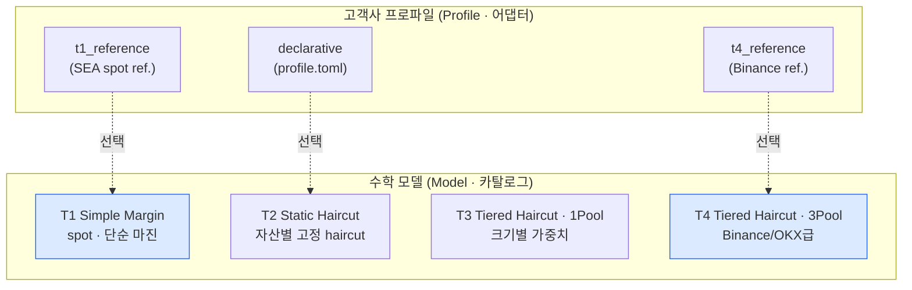
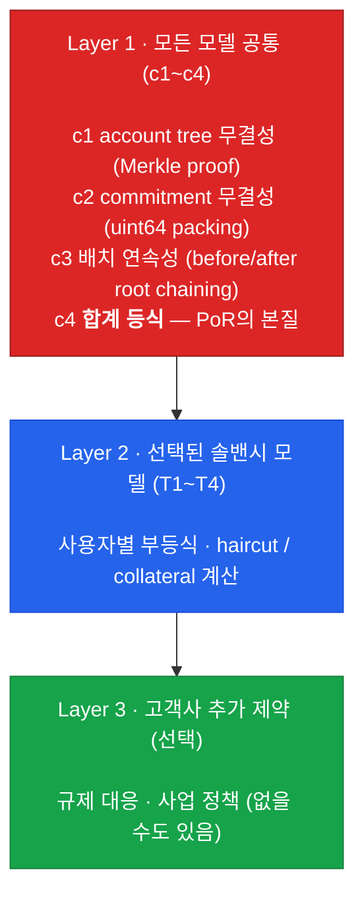
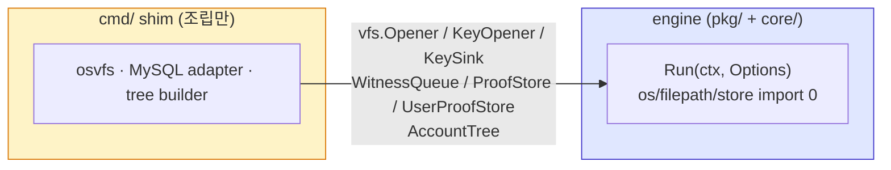
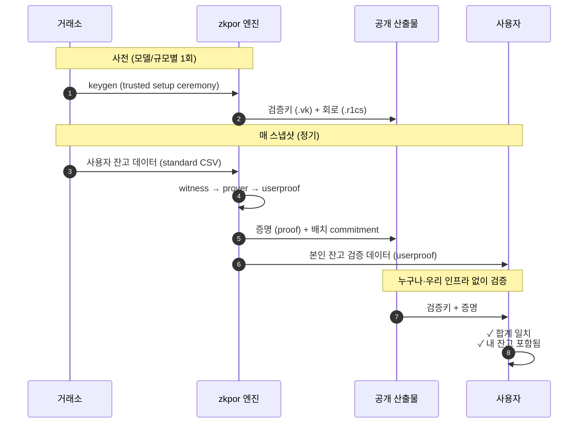
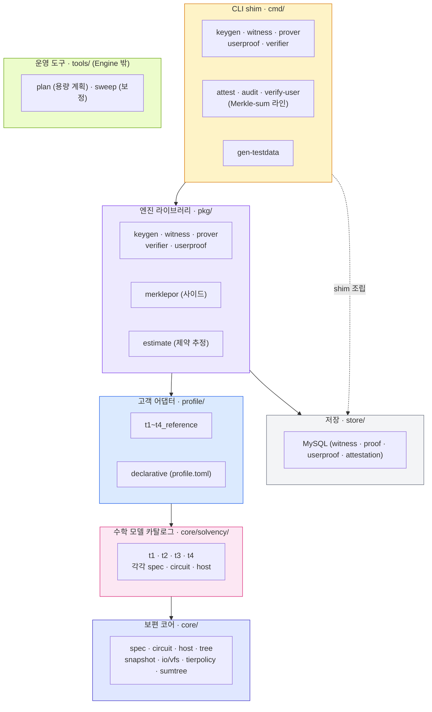
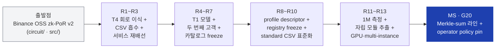

# zkpor — 거래소 솔밴시 증명 엔진

> 한 문장으로: **"거래소가 발표한 자산 총량이 실제 사용자 잔고의 합과 같다"**
> 를 사용자 데이터를 노출하지 않고 수학적으로 증명해주는 엔진 제품.

이 문서는 팀이 zkpor 프로젝트의 그림을 빠르게 잡기 위한 입문서입니다. 코드/암호학
용어보다는 **"왜 이렇게 만들었고, 이 시스템을 어떻게 머리에 그려야 하나"** 를
우선합니다. 세부는 `docs/01-project-context.md` 이하를 참조하세요.

- 모듈: `github.com/BetweenBits-org/zk-pos-ext` (자립 Go 모듈, 자체 git 저장소)
- 출발점: Binance OSS zk-PoR v2 (`circuit/`, `src/`) 를 표준화·일반화
- 최신 릴리스 태그: `v0.2.0` (pre-1.0, API 변경 가능)

---

## 1. 왜 만들었나

거래소의 "예치금 다 있어요" 주장은 전통적으로 두 가지 방식으로 입증되어 왔습니다.

| 방식 | 한계 |
|---|---|
| 외부 회계감사 | 비싸고 느림. 1년에 한 번. 회계법인을 믿어야 함. |
| Merkle PoR (대부분 거래소) | 자산 *합계* 만 증명. "이 자산이 누구 거고 부채는 얼마인지" 는 못 말함. 마진/론 사업이 있는 거래소는 무용지물. |

zk 기반 PoR은 이 한계를 두 가지로 메웁니다.

1. **합계뿐 아니라 사용자 한 명 한 명의 조건** 까지 검증 (예: 부채보다 자산이 많은가).
2. **사용자 잔고는 비공개로 유지**. 누구나 검증할 수 있지만 누구도 남의 잔고를 못 봄.

문제는 **이걸 직접 구현한 거래소가 전 세계에서 Binance, OKX 2~3곳뿐** 이라는 점.
나머지 거래소들은 "우리도 zk PoR 하고 싶지만 자체 개발은 못 한다" 상태.

→ **zkpor는 이 격차를 메우는 엔진 제품**. 한 번 만들어 둔 검증된 엔진을
여러 거래소에 SaaS 형태로 통합 판매합니다.


---

## 2. 멘탈모델 ① — Model × Profile 두 축

zkpor를 이해할 때 가장 먼저 잡아야 할 것: **두 개의 직교 축이 있다.**

- **Model (수학)** — 솔밴시를 어떻게 정의할지. "사용자별로 어떤 부등식을 검증할 것인가."
- **Profile (배포)** — 어느 거래소의 데이터를 어떻게 끼워 넣을지. "CSV 컬럼 매핑, ID 체계, 자산 카탈로그, 정책 핀."

같은 수학식(Model)을 여러 거래소(Profile)가 공유할 수 있고, 한 거래소가 사업이
바뀌면 Model만 갈아 끼우면 됩니다.



### 왜 이렇게 나눴나

만약 거래소마다 회로를 새로 짠다면 — 매번 감사를 새로 받아야 하고, 코드가
N배로 증식합니다. 반대로 "한 회로가 모든 케이스를 다 처리"하게 만들면 — 단순한
거래소까지 복잡한 검증 비용을 강제로 부담합니다.

**그래서 "수학 카탈로그"를 따로 두고 고객은 거기서 골라 쓰게 했습니다.** 카탈로그
한 entry당 한 번만 감사받으면, 그 모델을 쓰는 모든 거래소가 그 감사 신뢰를
공유합니다.

### 회로는 4-tier, 마케팅은 5-tier

회로는 T1~T4 네 개이지만, 시장에는 다섯 제품으로 보입니다 (T1 회로가 두 제품 겸용).

| Tier (마케팅) | Model ID | 타겟 고객 |
|---|---|---|
| Basic | `t1_simple_margin` (debt=0) | 한국/EU/일본 regulated spot, 스테이블코인 발행처, 커스터디 |
| Standard | `t1_simple_margin` (margin) | Bybit / KuCoin / HTX 급 mid-tier 마진 거래소 |
| Pro-A | `t2_static_haircut_margin` | 단일 collateral pool · 자산-level 고정 haircut |
| Pro-B | `t3_tiered_haircut_margin_1pool` | 파생-heavy · size-tiered haircut · 비즈니스 라인 미분리 |
| Enterprise | `t4_tiered_haircut_margin_3pool` | Binance / OKX class (VIP loan + cross + portfolio margin) |

Basic 과 Standard 는 **같은 회로 `.vk`** 를 공유합니다. 산업 reference·솔밴시 식·
결정 트레일은 `docs/04-solvency-models.md`.

---

## 3. 멘탈모델 ② — 한 회로 안의 3개 층

선택된 Model에 대해 회로가 강제하는 제약은 항상 3개 층으로 쌓입니다.

```text
setup = c1 ⊕ c2 ⊕ c3 ⊕ c4      // Layer 1: 모든 model 공통 (universal mandatory)
      ⊕ L[k]                    // Layer 2: 카탈로그에서 정확히 하나 선택, k ∈ {T1..T4, None}
      ⊕ alpha(profile)          // Layer 3: 고객사 ConstraintModule (add-only, 선택)
```



c4 (sum equality) 가 PoR의 환원 불가능한 본질 — 어떤 모델·고객·모듈도 c4를
약화할 수 없습니다.

핵심 규칙: **위 층의 제약은 아래 층이 절대 약화시키지 못한다 (add-only).** 고객이
원해서 어떤 검사를 끄는 것은 불가능합니다. 추가만 가능. 이게 "고객마다 다른 규제
요구"를 안전하게 받아들이는 메커니즘이며, ConstraintModule 을 얹으면 trusted setup
이 `(model, module)` pair별로 분기되고 `.vk` 파일명에 module ID가 노출됩니다.

---

## 4. 멘탈모델 ③ — 엔진은 "포트의 집합"이다

zkpor 엔진(`pkg/*` + `core/*`)은 **자기 손으로 파일·DB·트리를 직접 열지 않습니다.**
입력(스냅샷·키·설정)과 영속성(큐·증명·사용자증명 저장)을 전부 **포트(interface)로
주입받습니다.** 실제 파일·MySQL·트리 백엔드 연결은 얇은 `cmd/` shim 이 조립합니다.



이 구조가 주는 것:

- **소스 무관(source-agnostic)** — 로컬 파일이든 S3든 DB든, 포트만 구현하면
  엔진 코드 변경 0으로 백엔드를 갈아 끼웁니다 (R12-E/F/G에서 달성).
- **in-process 호출 가능** — 엔진은 `panic` 대신 `error` 를 반환하고
  `Run(ctx, ...)` 로 취소(cancel)를 지원해, 다른 Go 프로그램에 라이브러리로
  임베드할 수 있습니다.
- **테스트·감사 용이** — 엔진 핵심 경계에 OS·DB 부수효과가 없어 단위 테스트와
  계약 검증이 깨끗합니다.

> 현재 출하 adapter 는 **로컬 파일(osvfs) + MySQL(store) 단일**입니다.
> Redis/S3/PG 는 "포트만 구현하면 꽂히는" 미래 adapter 자리입니다.

---

## 5. 한 스냅샷이 흐르는 길

거래소가 zkpor을 운영할 때 실제로 무슨 일이 일어나는지.



다섯 개의 zk 서비스가 이 흐름을 분담합니다 (`cmd/`).

| 도구 | 언제 돌리나 | 무엇을 만드나 |
|---|---|---|
| `keygen` | 사전 1회 (모델/규모별) | 증명·검증 키 (`.pk`/`.vk`/`.r1cs`) |
| `witness` | 매 스냅샷 | standard CSV → 회로 입력(witness) |
| `prover` | 매 스냅샷 | 증명 (가장 무거운 단계) |
| `userproof` | 매 스냅샷 | 사용자가 자기 잔고를 확인할 수 있는 경로 |
| `verifier` | 누구나·언제든 | 증명이 유효한지 stateless 확인 |

키 파일 명명 규약: `zkpor.<model>.<assetTier>_<usersPerBatch>[.<module>].{pk,vk,r1cs}`.
거래소 이름은 들어가지 않습니다 (같은 tuple이면 `.vk` byte-equivalent → 감사 공유).

---

## 6. 우리가 보장하는 것 vs 보장 못 하는 것

이 시스템을 팔 때 가장 정확하게 말해야 하는 부분입니다.

### ✅ 보장하는 것

- 거래소가 발표한 자산 총량 = 사용자 잔고의 합 (수학적으로, = c4).
- 선택된 모델의 사용자별 솔밴시 조건을 모든 사용자가 통과 (예: 부채 ≤ 자산).
- 위 두 가지를 **사용자 데이터를 노출하지 않고** 증명.
- 사용자는 본인 잔고가 dataset에 포함됐는지 확인 가능 (self-inclusion).

### ❌ zk 단독으로 못 보장하는 것

- 거래소가 dataset에서 **누락시킨** 사용자 (있는데 안 넣은 경우).
- 거래소 내부 ETL이 잔고를 정확히 뽑았는지.
- snapshot 시점 *이후* 의 잔고 변동.
- "솔밴시 모델 자체가 합리적인가" (audit + catalog governance의 영역).

보완책: 사용자 self-inclusion verifier + `AccountIDProvider` derivation scheme 공개
+ 외부 audit. 이 한계를 모른 채 "zk PoR이면 100% 안전"으로 마케팅하면 신뢰를
잃습니다. 우리는 이 경계를 명확하게 그어 둔 것이 차별점 중 하나입니다.

---

## 7. 두 번째 제품 라인 — Merkle-sum proof-of-liabilities (비-zk)

메인 라인(T1~T4 zk PoS) 옆에 **별도 부속 라인**이 있습니다 (Stage MS, `pkg/merklepor`).
zk 없이, **감사인 재계산 + 발표 root 불변성** 을 신뢰 뿌리로 쓰는 부채증명입니다.

- **무엇** — Merkle **Sum** Tree (노드가 자식들의 sum을 carry → root가 곧 총부채).
  사용자는 자기 sum 기여까지 공개 검증할 수 있습니다.
- **언제** — 거래소가 무거운 trusted setup·proving 스택 없이 빠르게
  proof-of-liabilities를 내고 싶을 때. 감사인이 root를 재계산·대조하는 모델.
- **범위** — **T1 전용** (순잔고가 깔끔히 정의되는 모델), 부채까지만. reserves
  (온체인 지갑 총액)는 감사 input으로 받아 `RunAudit` 이 `Reserves ≥ Liabilities` 만
  비교 (멀티체인 RPC/지갑검증은 scope 밖).
- **격리** — `core/circuit`·`pkg/{keygen,prover}`·groth16·`.pk`/`.vk`·ceremony 에
  **import 의존 0**. 메인 zk 라인을 약화시키지 않도록 구조적으로 분리.

CLI: `attest` (sum-root + reconcile 발행) → `verify-user` (사용자 sum-inclusion) →
`audit` (≥0 / 중복 / range / sum 검증 + reserves 비교). T1 happy/insolvent 픽스처로
end-to-end 검증 완료.

---

## 8. 코드가 어디에 사는가

거시 지도. 세부는 `docs/02-module-architecture.md`, `docs/03-system-architecture.md`.



| 영역 | 책임 |
|---|---|
| `cmd/` | 얇은 CLI shim — flag 파싱 + 시그널 + 포트 조립 (`osvfs`/store adapter/tree). 엔진 로직 없음. |
| `pkg/` | 엔진 라이브러리 표면. `Options` 주입 + `Run(ctx, opts) error`. 안에 os/filepath/store import 0. |
| `profile/` | 고객 어댑터. `t1~t4_reference` + 선언형 `declarative` (profile.toml). 한 customer = 한 import. |
| `core/solvency/<model>/` | 4-tier 솔밴시 카탈로그. 모델당 `spec`(상수)·`circuit`(zk)·`host`(off-circuit + runner). |
| `core/` (universal) | 모델 무관 코어 — `spec`(계약·상수), `circuit`(Merkle/commitment/arith), `host`(leaf hash·port), `tree`(SMT), `snapshot`(standard CSV), `io/vfs`(소스 무관 포트), `tierpolicy`·`sumtree`. |
| `store/` | MySQL gorm — 유일 출하 adapter. gorm.Model 은 store row 에만 격리. |
| `tools/` | **엔진 밖** ops 도구 — `plan`(용량 계획), `sweep`(보정). 환경 결합 수치는 여기. |
| `scripts/` | smoke (`smoke.sh`) + EC2 측정 인프라 (`ec2/*`). |
| `circuit/`, `src/` (상위 디렉터리) | Binance OSS legacy reference. **수정 금지**, 별도 Go 모듈. zkpor는 이를 import하지 않음. |

의존 방향은 **위에서 아래로만**. 같은 층의 패키지끼리는 서로 import하지 않습니다
(고객끼리 분리·모델끼리 분리).

---

## 9. 핵심 특징

신규로 이 프로젝트에 손을 댈 때 알아두면 좋은 것들.

### 9.1 "모델 카탈로그 + 고객 어댑터" 구조

- 새 거래소를 받을 때 **회로를 새로 짜지 않습니다.** 카탈로그(T1~T4)에서 고르고,
  어댑터(`profile/<customer>/`)만 작성. 첫 도입은 보통 1~4개월.

### 9.2 수학과 사업 이름의 엄격한 분리

- 모델 이름에 거래소 이름을 박지 않습니다 (`t4_tiered_haircut_margin_3pool` ✓,
  `binance_v2` ✗). 같은 모델을 5개 거래소가 공유하면 감사 신뢰가 5배로 증폭됩니다.

### 9.3 add-only 확장

- 고객이 추가 제약(규제 대응 등)을 얹을 수 있지만, **기존 검증을 제거하거나
  약화시키는 경로는 차단**. 코드 구조로 강제.

### 9.4 검증은 stateless·공개

- 검증키와 증명만 있으면 누구나, 어디서나, 우리 인프라 없이도 검증 가능.
  우리는 엔진을 팔지, "신뢰 자체" 를 팔지 않습니다.

### 9.5 소스 무관 엔진 (포트 주입)

- 엔진 핵심 경계에 직접 파일·DB·트리 IO가 없습니다 (§4). 백엔드 교체 = adapter
  교체. in-process 라이브러리로도 임베드 가능.

### 9.6 정책도 public commitment에 묶인다 (operator pin)

- T2 haircut·T3/T4 tier 같은 위험 정책 값은 CEX commitment에 패킹되어 public
  `BatchCommitment` 에 바인딩됩니다. `core/tierpolicy` 가 capacity-비의존 정책
  digest를 만들고, 운영자가 `profile`에 정책 digest를 핀하면 엔진이 스냅샷에서
  재계산해 불일치 시 reject (fail-closed) — 정책 author를 거래소(tenant)가 아니라
  운영자(operator)로 고정합니다 (G20).

### 9.7 GTM은 카탈로그 진척 순서와 다름

- 기술 진척은 T4(Binance)부터 — Binance OSS 코드를 출발점으로 썼기 때문.
- **시장 우선순위는 T1부터** — 동남아 거래소 대부분이 T1. 진척과 시장이 역전.
  그래서 R4 이후 작업은 T1을 주력 제품으로 끌어올렸습니다.

---

## 10. 걸어온 길 — 히스토리

이 엔진은 Binance OSS PoR을 출발점으로, "검증된 회로 1벌"에서 "제품화된 엔진"으로
단계(R-stage)를 밟아 왔습니다. 자세한 결정 트레일은 `PRODUCTION_ROADMAP.md`.



주요 분기점:

- **출발 (2026-05)** — Binance OSS zk-PoR v2 위에서 productization 시작. POC 단계는
  의도적으로 생략 (이미 검증된 코드 베이스이므로).
- **R1~R3 — Foundation** — `t4_tiered_haircut_margin_3pool` 회로 이식, CSV ETL 흡수,
  4개 서비스 재배선. trusted-setup byte-equivalence를 R1CS matrix SHA256으로 검증
  (G1), identity scheme freeze (G2).
- **R4~R5 — model-first swap** — SEA 시장 조사 결과 *진척과 수요의 역전*을 발견.
  `t1_simple_margin` 회로를 먼저 구현하고 (R4), 그 위에 첫 SEA reference 고객을
  올림 (R5). T4는 reference로 가치 유지하되 "주력"에서 내려옴.
- **R6~R7 — 카탈로그 정리·동결** — spot을 T1로 흡수해 5-tier → 4-tier 회로로 통합,
  rule-of-three 기반 universal helper 승격 (G11), **v1 카탈로그 4-tier FROZEN** (G4).
- **R8~R10 — 표준화** — profile descriptor wiring, registry pattern v1 freeze (G17),
  고객 raw 데이터를 **모델별 standard CSV로 표준화** (G13/G18). 엔진은 canonical
  standard CSV만 소비, 고객 raw normalization은 엔진 밖.
- **R11 — 측정 test bed** — `gen-testdata` + smoke + EC2 측정. R11-D에서 prove
  메모리가 거의 **binary step** (sparse ≤50% ~62-66 GiB plateau, dense 100% ~118-122
  GiB step) 임을 실측, linear scaling 가설을 폐기.
- **R12 — 엔진 리팩터 + 자립 모듈** — source-agnostic input (R12-E), persistence port
  inversion (R12-F), TreeDB injection (R12-G)으로 §4의 포트 구조 완성. 이어서 binance
  OSS overlay subdir에서 **자립 Go 모듈** `github.com/BetweenBits-org/zk-pos-ext` 로
  추출 (v0.1.0).
- **R13 — 가속 & 스케일** — GPU 가속(ICICLE) 포팅을 build-tag seam으로 배선,
  L4 GPU 박스에서 검증 (**4.4M 제약에서 GPU 2.65× 전체 / prover phase 5.18×**,
  크로스오버 4.4M 미만). multi-instance claim 원자성은 `FOR UPDATE SKIP LOCKED` adapter로
  보장 (엔진 본체 0 변경).
- **Stage MS — Merkle-sum 사이드 라인** (§7) — 비-zk proof-of-liabilities, T1 전용,
  메인 라인과 import 격리 (v0.1.1 → v0.1.2).
- **G20 — operator policy pin** (§9.6) — `core/tierpolicy` canonical builder + 정책
  commitment, T2 haircut cap soundness 수정 (v0.2.0).

---

## 11. 현재 어디까지 왔나

| 항목 | 상태 |
|---|---|
| 4개 솔밴시 모델 (T1~T4) 회로 구현 + 카탈로그 freeze | ✅ 완료 |
| 고객 어댑터 (t1~t4 reference + declarative profile.toml) | ✅ 완료 |
| 5개 zk 서비스 4-model dispatch + end-to-end smoke | ✅ 통과 |
| standard CSV 입력 표준화 (모델별 schema freeze) | ✅ 완료 |
| 자립 Go 모듈 추출 (`zk-pos-ext`) | ✅ 완료 (v0.1.0) |
| 소스 무관 엔진 — IO·영속성·트리 전부 포트 주입 | ✅ 완료 (R12-E/F/G) |
| multi-instance prover claim 원자성 | ✅ 완료 (R13-D) |
| GPU 가속 (ICICLE) | ✅ 검증 (영구 통합 방식 미결) |
| Merkle-sum proof-of-liabilities 라인 (Stage MS) | ✅ landed + e2e 검증 (v0.1.2) |
| operator policy pin (`core/tierpolicy`) | ⏳ core·B-core landed, profile pin 배선 잔여 |
| 운영 용량 계획 도구 (`tools/plan` + `pkg/estimate`) | ✅ 완료 |
| 대규모 성능·메모리 측정 (R11-D, EC2) | ✅ 완료 + GPU 크로스오버 실측 |

### 알려진 후속 작업

- **G20 B-wire** — `profile.toml [risk_policy] commitment` additive 필드 + snapshot-load
  digest 대조 reject. 첫 operator-enforced 정책 고객 전에 close.
- **T2 trusted setup 재실행** — T2 회로에 `haircut_bp ≤ 10000` cap을 추가(soundness
  수정, add-only)했으므로 R1CS가 바뀜 → T2 키를 재생성하고 NbConstraints baseline을
  재기록해야 함.
- **GPU 영구 통합 방식** — gnark fork vendor vs fork-repo 결정 + 대규모 speedup
  (T4-scale, L40S) 재현.
- **port 의 첫 non-local adapter** — Redis `WitnessQueue` / S3 `vfs.Opener` (엔진
  코드 변경 0, adapter + cmd wiring만).

자세한 stage 진척은 `PRODUCTION_ROADMAP.md`, 현재 시점 상태는 `HANDOFF.md`,
성능·견적은 `docs/BENCHMARK.md`.

---

## 12. 더 읽을 문서 (우선순위 순)

| 문서 | 언제 읽나 |
|---|---|
| `AGENTS.md` | 작업 시작 시 가장 먼저 — 작업 규약 (authoritative contract) |
| `docs/01-project-context.md` | 개념·강한 보장·V1 범위·시장 컨텍스트 |
| `docs/02-module-architecture.md` | 고객 추가 제약(Module)·registry·standard schema를 만들 때 |
| `docs/03-system-architecture.md` | 시스템 그림 자세히 (다이어그램 다수) |
| `docs/04-solvency-models.md` | 4개 모델의 산업 reference + 결정 트레일 |
| `PRODUCTION_ROADMAP.md` | go-forward 로드맵 — 두 트랙(v1 freeze / v2 sovereign fork) + Gate Register |
| `PRODUCTION_ROADMAP_v1_FROZEN.md` | 1차 로드맵 이력 (frozen) — closed gate 결정 트레일 |
| `HANDOFF.md` | 지금 무엇이 진행 중인지 (현재 시점 인수인계) |
| `docs/BENCHMARK.md` | 성능·메모리·비용 견적 단일 진실원 |
| `docs/R13_GPU_RUNBOOK.md` | GPU 측정 절차 |
| `tools/README.md` | 용량 계획·보정 도구 (엔진 밖 ops) |

---

## 부록 A — Go 의존성으로 통합 (gnark fork replace 필수)

zk-pos-ext 는 **자립 Go 모듈**입니다.

- module path: `github.com/BetweenBits-org/zk-pos-ext`
- 로컬 빌드/테스트: `cd zkpor && go build ./... && go test -short ./...`

**다른 Go 모듈에서 import 할 때는, 자기 `go.mod` 에 아래 `replace` 2줄을
반드시 추가해야 합니다.** (없으면 빌드 실패 또는 증명/검증이 깨짐.)

```
replace (
    github.com/consensys/gnark        => github.com/bnb-chain/gnark        v0.10.1-0.20240910145009-4b5261061f04
    github.com/consensys/gnark-crypto => github.com/bnb-chain/gnark-crypto v0.14.1-0.20240910145340-609ab3a7eb9b
)
```

### 왜 필요한가

- 엔진은 `consensys/gnark` 를 import 하지만 실제로는 **Binance fork**
  (`bnb-chain/gnark`) 를 써야 합니다. trusted setup·증명이 이 fork 동작에
  의존하므로, replace 가 빠지면 upstream gnark 가 당겨져 빌드 실패 또는
  증명/검증이 깨집니다.
- fork 의 go.mod 가 자기 module 을 `github.com/consensys/gnark` 로 선언
  (drop-in 목적) 하므로 `bnb-chain/gnark` 경로로 **직접 import 는 불가** —
  `replace` 가 유일한 연결 수단입니다.
- Go 의 `replace` 는 **main module 에서만 유효 (비-전이)**. 그래서 위 2줄은
  zk-pos-ext 를 **쓰는 쪽이 직접** 자기 go.mod 에 재선언해야 하며 상속되지
  않습니다. (k8s·블록체인 fork 생태계의 관례적 패턴 — consumer 가 위 블록을
  복붙하면 됩니다.)

### 버전 핀

```
require github.com/BetweenBits-org/zk-pos-ext v0.2.0
```

pre-1.0 이므로 API(엔진 `Options` 등)는 breaking 변경될 수 있습니다. **gnark replace
2줄은 버전과 무관하게 별도로 유지**해야 합니다 (위 참조). repo 가 private 이면
consumer 쪽에 `GOPRIVATE=github.com/BetweenBits-org/*` + git 인증 설정이 필요합니다.

---

## 부록 B — 빌드 · 테스트 · 스모크

zkpor 는 자립 모듈이므로 모든 명령은 `zkpor/` 에서 실행합니다 (outer 모듈에서
`./zkpor/...` 로 빌드하지 않음).

```bash
cd zkpor
go build ./...
go vet ./...
go test -short ./...

# end-to-end smoke (profile-driven, MySQL fixture 필요)
./scripts/smoke.sh profile/t1_reference/t1_reference.toml

# 용량 계획 (제약 추정 → RAM/디스크/시간/인스턴스 추천)
go run ./tools/plan -model t4_tiered_haircut_margin_3pool -users 1000000 -capacity 500
```

고정된 암호 파라미터: Poseidon over BN254 · Sparse Merkle Tree depth 28
(2^28 ≈ 268M accounts) · AssetCounts 500 · ValueScale 1e16
(`PriceMultiplier × BalanceMultiplier`).

---

## 한 줄로 다시

> **검증된 zk 회로 1벌을 4개 솔밴시 모델로 카탈로그화하고, 거래소는 어댑터만
> 끼워서 운영하게 만든 PoR 엔진 제품** — 입력·저장·트리를 전부 포트로 주입받는
> 소스 무관 자립 모듈로, 그 옆에 비-zk Merkle-sum 부채증명 라인을 함께 둔다.
