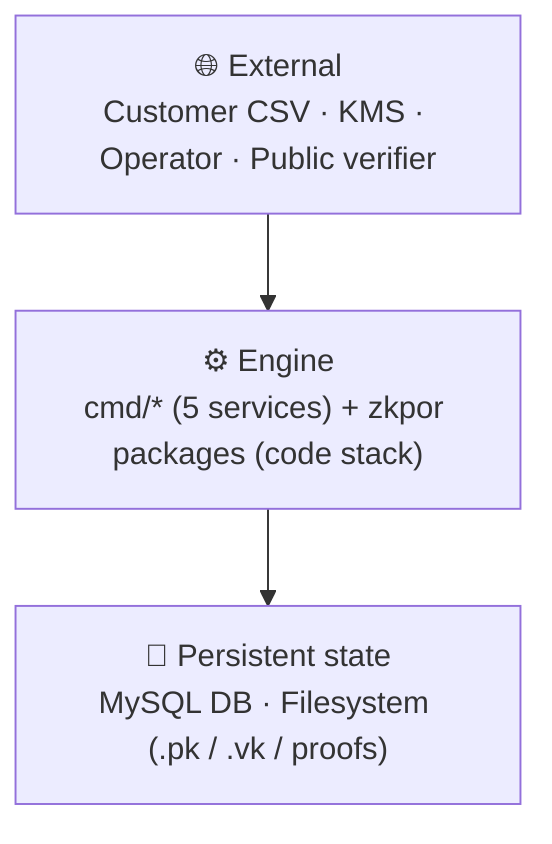
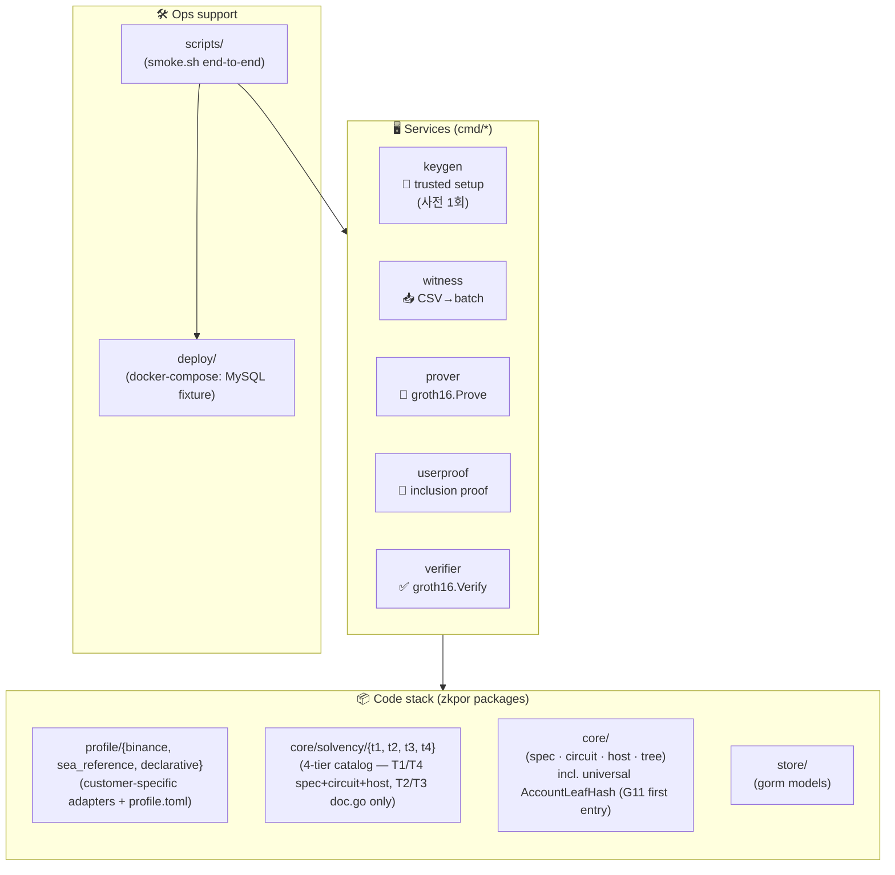
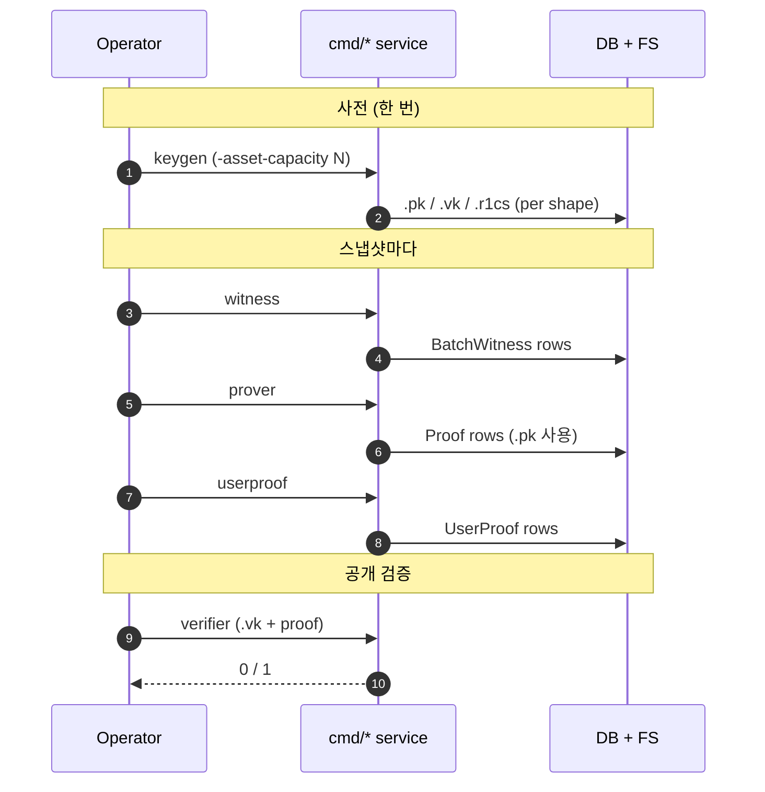
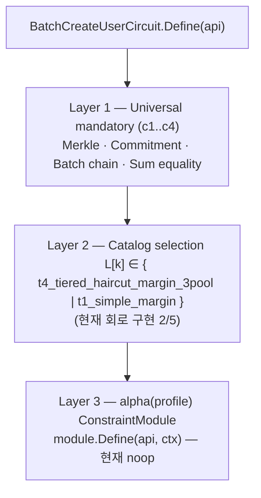
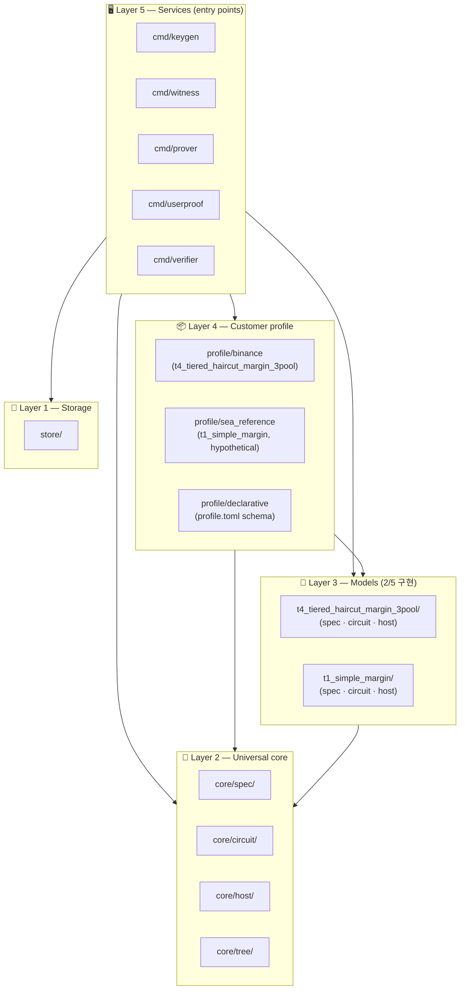
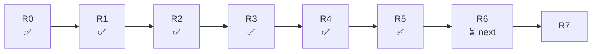

# zkpor System Architecture (overview)

**Snapshot 시점**: 2026-05-26 / R6 종결 직후 (4-슬라이스 chain
`b0318e1 → 829e81c → 722a133 → R6-close`).  
**기준**: 코드 (`zkpor/` 트리) + `PRODUCTION_ROADMAP.md` stage 정의.

R6 변경 요약: 카탈로그 5→4 통합 (`spot_simple` + `merkle_classic` →
`t1_simple_margin` superset), Tn naming v1, 4 model 통일 5-input Poseidon
AccountLeaf signature, `core/host.AccountLeafHash` universal helper
promotion (G11 first entry). 자세한 결정 트레일은 `docs/04-solvency-models.md`.

이 문서는 다이어그램 중심의 system overview 다. 한 번에 한 다이어그램,
한 다이어그램이 한 가지 질문만 답하도록 설계 — "전체 어디에 뭐가 있나",
"시간 순서로 무슨 일이 일어나나", "회로 안 제약이 어떻게 쌓이나", "코드
의존이 어디로 흐르나", "지금 어느 단계인가".

세부 lock 은 `01-project-context.md` (concept) + `02-module-architecture.md`
(module spec) + `PRODUCTION_ROADMAP.md` (stage) 가 담당. 이 문서는 그
셋의 visual summary.

---

## 1. "어디에 뭐가 있나" — 3-tier 스택

엔진을 가장 거시적으로 보면 3 단:

이 한 다이어그램이 `## Scope Boundary` 의 그림판. **Engine 안의 모든
선택은 이 세 박스 안에서 일어난다** — UI / web frontend 는 External
쪽 책임.

### 1.1 Engine 안 — 5 서비스 + 코드 스택

서비스가 코드 스택의 어디든 import 할 수 있지만, **import 화살표는
항상 위에서 아래로 흐른다**. profile → model → universal. 순환 없음.

`profile/declarative/` 는 schema-only — `profile.toml` Load/Validate
만 담당, 회로/service 경로에는 아직 wire-in 되지 않음 (R7 freeze
직전 candidate).

---

## 2. "시간 순서로 무슨 일이" — happy-path sequence

operator 가 명령을 어느 순서로 돌리고, 각 단계가 무엇을 만드는지.

**의미**:
- (1~2) Trusted setup 은 shape 별 한 번 (`cmd/keygen`). `.pk` 는
  production 비밀, `.vk` 는 공개. shape = `(asset_capacity, tier,
  users)` — capacity 가 stem 에 없어 operator 가 디렉터리 컨벤션으로
  격리 (G12).
- (3~8) 매 snapshot 마다 witness → prover → userproof 순서로 실행.
  세 서비스가 모두 끝나야 검증 가능 상태.
- (9~) verifier 는 stateless. `.vk` + proof 만으로 동작.

각 service 의 세부 dependency 가 궁금하면 §4 의 layer 그림 참조.

---

## 3. "회로 안 제약이 어떻게 쌓이나" — 3 layer

`BatchCreateUserCircuit.Define(api)` 안에서 emit 되는 제약은 3 단:

**핵심 규칙**:
- 위 layer 가 먼저 emit, 그 다음 아래 layer 가 추가만.
- **add-only** — 어느 layer 도 위 layer 의 제약을 약화·제거 못 함.
  이게 alpha layer 의 N-module composition 안전성의 수학적 근거
  (`docs/02-module-architecture.md` §1).
- 5 model 카탈로그 중 회로 구현 = `t4_tiered_haircut_margin_3pool` (R1) + `t1_simple_margin`
  (R4, SEA GTM). 나머지 3 (`t3_tiered_haircut_margin_1pool`, `t2_static_haircut_margin`,
  `t1_simple_margin`) 는 doc.go reserved — R6 rule-of-three trigger 대기.

---

## 4. "코드 의존이 어디로" — 5 layer stratification

화살표 대신 **위/아래 위치**로 의존 방향을 표현. 모든 import 는 위에서
아래로 흐른다. 같은 layer 안에서는 import 없음 (또는 최소).

**관찰**:
- 화살표 7 개만 — 각 layer 가 어떤 하위 layer 에 의존하는지의 *aggregate*.
- 개별 패키지 간의 화살표는 생략 (같은 layer 안의 패키지들은 보통 함께
  쓰인다고 보면 됨).
- Layer 4 의 customer profile 들은 **서로 import 하지 않음** —
  `binance` 와 `sea_reference` 는 동일 universal contract (특히
  `passthrough_hex_bn254_reduced.v0` identity scheme) 위에서 평행
  관계. profile/declarative 는 schema-only.
- Layer 3 의 model 들도 **서로 import 하지 않음** — 둘 다 Layer 2
  universal 위에서 독립. R6 rule-of-three trigger 시 model 간 중복
  symbol (`PowersOfSixteenBits` 등) 이 Layer 2 로 promote 예정.
- legacy (`../circuit/`, `../src/`) 참조는 test 파일 2개 (G1 byte-
  equivalence gate) 에만 — production 코드는 0 dependency.
- store/ 는 spec 의존 없는 순수 영속화 — services 만 사용.

---

## 5. "지금 어느 단계인가" — stage timeline

가장 거시적인 진척 상태. 한 줄.

| Stage | 목표 | 상태 |
|---|---|---|
| R0 | Decision gate triage | ✅ closed |
| R1 | t4_tiered_haircut_margin_3pool 회로 이식 | ✅ closed |
| R2 | CSV ETL absorb | ✅ closed |
| R3 | 회로/Setup 검증 + 4 service rewiring + end-to-end smoke | ✅ closed (commit d7c23f3) |
| R4 | `t1_simple_margin` 회로 (SEA GTM driver) | ✅ closed (commit f511dcb) |
| R5 | SEA reference customer profile + declarative `profile.toml` | ✅ closed (commit b5b3236) |
| R6 | 3번째 model + core/circuit 헬퍼 promotion | ⏳ next (rule-of-three trigger) |
| R7 | v1 catalog freeze | ⏳ pending |

### 5.1 R3 / R4 / R5 sub-slice 진척 (종결된 stage 들)

**R3 — 5 step (step 4 본체 = 4 service rewiring, agent 자율 분해)**:

| Sub-slice | 내용 | 상태 |
|---|---|---|
| R3 step 0 | Setup smoke (Compile + Setup) | ✅ |
| R3 step 1 | G13 (fr.Element 정규화 위치) closure | ✅ |
| R3 step 2 | alpha wiring + fr.Element impl | ✅ |
| R3 step 3 | G1 byte-equivalence 절차 + 실행 | ✅ |
| R3 step 4a..h | core/host extract + 4 services + G2/G6 closure + G1 hint | ✅ |
| R3 step 4 E | AssetCounts → profile-owned + catalog source-of-truth | ✅ |
| R3 step 4 A1..A5 | shape override + MySQL fixture + keygen + DB direct read + end-to-end smoke | ✅ |

**R4 — second model `t1_simple_margin`**:

| Sub-slice | 내용 | 상태 |
|---|---|---|
| R4-0 | spec package (types, snapshot, witness, constraint) | ✅ |
| R4-1 | circuit (BatchCreateUserCircuit + 2-tuple AccountAsset) | ✅ |
| R4-2 | Setup smoke + ComputeFlatUint64Commitment fix | ✅ |
| R4-3 | substrate audit (core/circuit 헬퍼 추가 불필요) | ✅ |

**R5 — second customer profile (sea_reference, hypothetical)**:

| Sub-slice | 내용 | 상태 |
|---|---|---|
| R5-0 | t1_simple_margin host helpers (off-circuit) | ✅ |
| R5-1 | sea_reference 6 어댑터 (no snapshot) | ✅ |
| R5-2 | sea_reference snapshot CSV adapter + happy fixture | ✅ |
| R5-3 | declarative `profile.toml` schema + 2 instantiations | ✅ |
| R5-4 | G12 closure (multi-customer `.vk` 공유 정책) | ✅ |

R5 follow-up: sea_reference end-to-end smoke (R3 의 binance smoke 패턴
재활용) 는 별도 슬라이스로 보류 — R6 진입 전 자연스러운 연결고리.

---

## 6. Decision Gate Register snapshot

closed 8 / deferred 8. R3·R4·R5 에 필요한 모든 gate
(G1/G2/G6/G12/G13) closed.

| Gate | 상태 | 잠금 시점 |
|---|---|---|
| G1 trusted-setup byte-equivalence | ✅ | R3 step 3 (commit 1398e04) |
| G2 AccountIDProvider scheme v1 freeze | ✅ | R3 step 4h (commit 3c691cb) |
| G6 ValueScale invariant assert | ✅ | R3 step 4c (commit 5332f40) |
| G7 InvalidAccountPolicy | ✅ | R0 |
| G8 BatchShape v1 | ✅ | R0 |
| G9 module ID 명명 규약 | ✅ | R0 |
| G12 multi-customer `.vk` 공유 정책 | ✅ | R5 step 4 (commit 8fb5b3f) |
| G13 AccountID fr.Element 정규화 위치 | ✅ | R3 step 1 |
| G3 ConstraintModule API freeze | ⏸ | first non-noop module |
| G4 catalog stability 선언 | ⏸ | R7 |
| G5 RiskPolicy 데이터 schema | ⏸ | R2 후 customer review |
| G10 LegacyKeyName 폐기 | ⏸ | R7 |
| G11 core/circuit 헬퍼 승격 규약 | ⏸ | R6 (rule-of-three trigger) |
| G14 사용자-facing verification 분배 | ⏸ | post-V1 / customer SLA |
| G15 Prove-path GPU 가속 | ⏸ | post-R3 / first production prove SLA |
| G16 Module composition compatibility | ⏸ | first multi-module composition (R5 candidate) |

자세한 next-action 은 `PRODUCTION_ROADMAP.md` Decision Gate Register 참조.

---

## 7. 이 문서를 어떻게 읽고 갱신하나

**한 다이어그램 = 한 질문**. 이 원칙을 깨는 추가 다이어그램은 별도 섹션
또는 별도 문서로.

**갱신 시점**:
- 새 stage 종료 → §5 timeline + 표 갱신.
- 새 gate closure → §6 표 갱신.
- 새 layer / 새 service 도입 → §1.1 또는 §4 갱신.
- 새 alpha hook (Composition / Param input) → §3 갱신.

**source-of-truth 우선순위** (PRODUCTION_ROADMAP §1 와 동일):
1. `core/spec/` 코드.
2. `docs/01-project-context.md` — concept.
3. `docs/02-module-architecture.md` — module spec lock.
4. `PRODUCTION_ROADMAP.md` — stage / gate.
5. **이 문서 (`03-system-architecture.md`)** — 위 셋의 visual summary.
   충돌 시 상위가 우선.
6. AGENTS / CLAUDE / HANDOFF.

이 문서가 박지 않는 것:
- 결정 (gate closure, API freeze) — 02 / ROADMAP.
- 컨셉 / scope — 01.
- 휘발성 상태 (어떤 슬라이스 진행 중) — HANDOFF.
